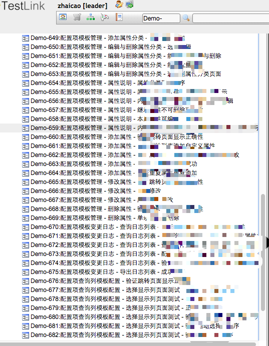
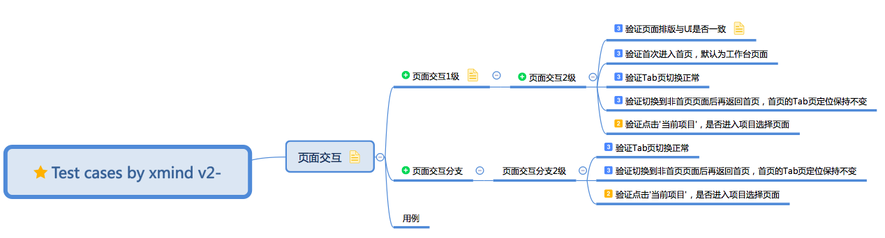
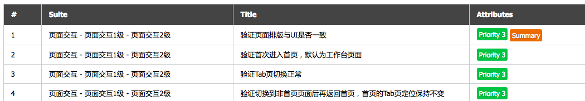
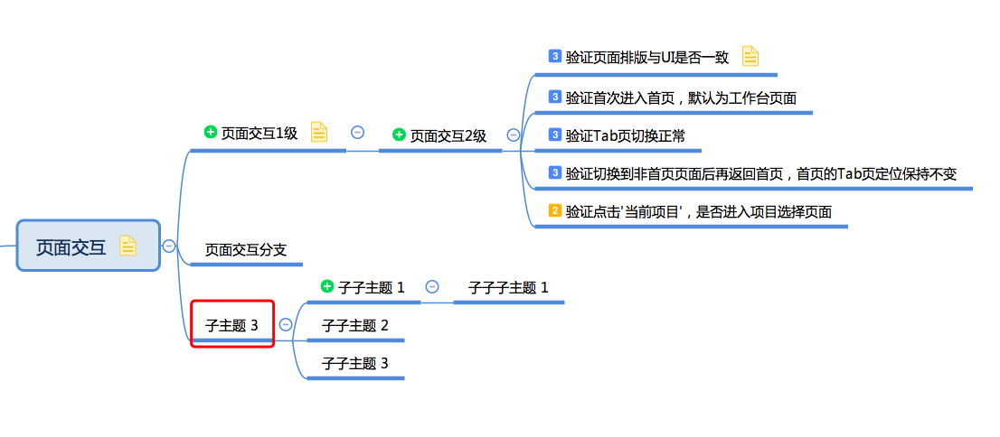
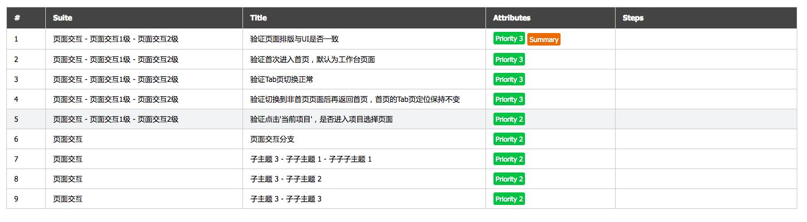

# xmind2testlink-S

在原xmind2testlink 2.0.5基础上增强了部分功能
> **原地址：https://github.com/tobyqin/xmind2testlink**
> 中文说明：[xmind2testlink - 快速设计测试案例并导入TestLink](https://tobyqin.github.io/posts/2017-07-27/use-xmind-to-design-testcase/)，如果你的xmind中包含中文或者unicode，请使用Python 3.4+，谢谢。

## 改进
**增加xmind测试集(Suite)自定义功能** 

xmind2testlink2.0.5只能生成一级测试集，后续的测试集层次结构都会与测试用例标题拼接而成。若测试集下的用例较多时，不好区分。



在保留原功能的基础上，可以根据自己的需求将某个层级设置为测试集，使用xmind中的符号区分。若未使用该符号的，将依照原版本拼接成用例名。



web界面已做修改适配，如有多层级suite，通过'-'拼接后，显示在suite中。



```buildoutcfg
自定义的图标可以在`xmind2testlink/sharedparser`中修改变量_config。
```
### 使用注意
- 若之前通过pip或setup.py安装xmind2testlink，需先卸载掉原来版本，在根目录下使用`python setup.py install`安装即可。
- 如果自定义的测试集(suite)的父节点，没有设置为测试集，则该测试集自定义无效，如：
  

  预览效果:

  
  
## Docker
- [1.0.0](Dockerfile), [latest](Dockerfile)
```buildoutcfg
$ docker pull ricky29711/xmind2testlink-s:latest
```
### How to use this image
start a xmind2testlink-S instance,default port 5001:
```buildoutcfg
$ docker run --name xmind2testlink-s -p 5001:5001 -d ricky29711/xmind2testlink-s:latest
```
if you need to store data of files
```buildoutcfg
$ docker run --name xmind2testlink-s -p 5001:5001 
    -v ~/xmind2testlink-s/:/opt/web/uploads 
    -d ricky29711/xmind2testlink-s:latest
```


