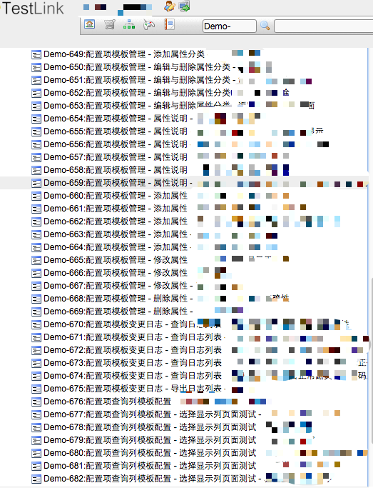

# xmind2testlink

[](https://pypi.org/project/xmind2testlink/)
[](https://codeclimate.com/github/tobyqin/xmind2testlink)

> 中文说明：[xmind2testlink - 快速设计测试案例并导入TestLink](https://tobyqin.github.io/posts/2017-07-27/use-xmind-to-design-testcase/)，如果你的xmind中包含中文或者unicode，请使用Python 3.4+，谢谢。
**原地址：https://github.com/tobyqin/xmindparser**


### 改进
**增加xmind测试集(Suite)自定义功能** 

原版本只能生成一级测试集，后续的测试集层次结构都会与测试用例标题拼接而成。若测试集下的用例较多时，不好区分。



在保留原功能的基础上，可以根据自己的需求将某个层级设置为测试集，使用xmind中的符号区分。若未使用该符号的，将依照原版拼接成用例名。


```buildoutcfg
自定义的图标可以在`xmind2testlink/sharedparser`中修改变量_config。
```

#### Note

```buildoutcfg
Web页面暂未修改，可能会造成预览显示不全的现象，但不影响xml文件的下载。
```


